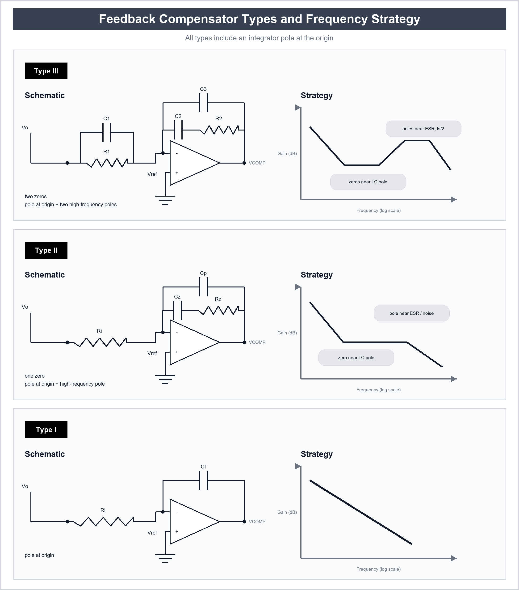

# 極點、零點與 Type I/II/III 補償器設計

> 全文件統一使用 LLC 變壓器匝比定義：`n = Np / Ns`。

## 控制迴路圖

控制迴路設計的目標不是讓補償器看起來很漂亮，而是讓整個 open-loop gain 在目標頻寬內有足夠增益、足夠 phase margin，並且在負載、輸入、元件誤差與溫度變化時仍然穩定。

## 控制迴路基本架構

典型 voltage feedback power supply 可看成：

```text
Vref → error amplifier / compensator → PWM modulator → power stage → Vout
                                     ↑                         ↓
                                     └──── feedback divider ───┘
```

open-loop transfer function：

```text
T(s) = Gc(s) × Gp(s) × Gm × H(s)
```

| 符號 | 意義 |
|---|---|
| `Gc(s)` | 補償器 transfer function |
| `Gp(s)` | power stage transfer function |
| `Gm` | PWM modulator gain |
| `H(s)` | feedback divider gain |
| `T(s)` | loop gain |

設計時主要看：

```text
fc = crossover frequency，|T(j2πfc)| = 1 = 0 dB
PM = phase margin
GM = gain margin
```

常見目標：

```text
PM ≈ 45° ~ 70°
GM > 6 dB
fc < fs / 10
```

若有 right-half-plane zero，例如 Boost 或 Buck-Boost CCM，`fc` 通常還要低於 `fRHPZ / 5`，保守可用 `fRHPZ / 10`。

## Type I / II / III 補償器總覽圖



## 極點與零點直覺

一個 pole：

```text
Gp(s) = 1 / (1 + s/ωp)
fp = ωp / (2π)
```

效果：

- 頻率低於 `fp`：gain 幾乎不變。
- 頻率高於 `fp`：斜率多下降 `-20 dB/dec`。
- phase 最多往下掉 `-90°`。

一個 left-half-plane zero：

```text
Gz(s) = 1 + s/ωz
fz = ωz / (2π)
```

效果：

- 頻率高於 `fz`：斜率增加 `+20 dB/dec`。
- phase 最多增加 `+90°`。
- 補償器通常用 zero 抵銷 power stage pole 的相位落後。

right-half-plane zero：

```text
Gz,RHP(s) = 1 - s/ωz
```

效果：

- gain 斜率看起來像 zero，增加 `+20 dB/dec`。
- phase 卻像 pole，額外下降 `-90°`。
- 這是 Boost / Buck-Boost CCM 很難拉高頻寬的主因。

## 輸出 LC 雙極點與 ESR 零點

對 voltage-mode Buck，輸出 LC 會形成雙極點：

```text
fo = 1 / (2π × sqrt(L × Cout))
```

輸出電容 ESR 形成零點：

```text
fESR = 1 / (2π × ESR × Cout)
```

LC 雙極點的影響：

```text
slope: -40 dB/dec
phase: 最多接近 -180°
```

ESR zero 的影響：

```text
slope: +20 dB/dec
phase: 最多增加 +90°
```

陶瓷電容 ESR 很低，因此 `fESR` 可能非常高，對 crossover 附近幫助不大。這種情況常需要 Type III 補償器。

## RHP zero

Boost CCM 的 RHP zero 常用近似：

```text
fRHPZ,boost = Rload × (1 - D)^2 / (2πL)
```

Buck-Boost CCM 的 RHP zero 常用近似：

```text
fRHPZ,buckboost = Rload × (1 - D)^2 / (2πL)
```

其中：

```text
Rload = Vo / Io
```

設計限制：

```text
fc <= fRHPZ / 5
```

更保守：

```text
fc <= fRHPZ / 10
```

RHP zero 不能用一般補償器 zero 抵銷，因為它會增加 gain 但降低 phase。比較好的做法是降低 crossover frequency，或改用 current-mode、interleaving、較小 L、不同 topology 等方式改善。

## Type I 補償器

Type I 是一個積分器：

```text
Gc(s) = K / s
```

### Type I 電路圖

近似 transfer function：

```text
Zfb = 1 / (sCf)
Zin = Ri
Gc(s) = Zfb / Zin
Gc(s) = 1 / (s × Ri × Cf)
```

形成：

```text
pole at origin
```

特性：

- 原點有一個 pole。
- DC gain 很高，可降低 steady-state error。
- phase 約 `-90°`。
- high-frequency roll-off 為 `-20 dB/dec`。

適用：

- plant 本身已經很穩。
- crossover 很低。
- 常見於簡單低頻控制或 current-mode 內迴路已處理主要動態時。

限制：

- 不提供 phase boost。
- 對 voltage-mode Buck 的 LC 雙極點通常不夠。

## Type II 補償器

Type II 包含：

```text
1 pole at origin
1 zero
1 high-frequency pole
```

### Type II 電路圖

等效理解：

```text
Ri  決定輸入阻抗
Cz  在低頻近似開路，與 op amp 形成高 DC gain / 原點 pole
Rz + Cz 形成補償 zero
Cp  與 Rz 在高頻形成補償 pole
```

常用近似：

```text
fz1 ≈ 1 / (2π × Rz × Cz)
fp1 ≈ 1 / (2π × Rz × Cp)
```

常見形式：

```text
Gc(s) = K × (1 + s/ωz1) / [s × (1 + s/ωp1)]
```

效果：

- 原點 pole 提供高 DC gain。
- zero 提供 phase boost，用來補 power stage pole。
- high-frequency pole 降低 switching noise。

常用設計法：

```text
fz1 放在 power stage dominant pole 附近
fp1 放在 ESR zero 或 fs/2 以下
fc 選在 fz1 與 fp1 之間
```

對 current-mode Buck，power stage 常近似一階系統，因此 Type II 很常用。

設計步驟：

1. 量測或計算 plant gain `Gp(s)`。
2. 選 `fc`，通常小於 `fs/10`。
3. 在主要 pole 附近放 `fz1`。
4. 在 ESR zero 或高頻雜訊前放 `fp1`。
5. 調整 `K`，讓 `|T(j2πfc)| = 0 dB`。
6. 檢查 phase margin 是否足夠。

## Type III 補償器

Type III 包含：

```text
1 pole at origin
2 zeros
2 high-frequency poles
```

### Type III 電路圖

Type III 常用在 voltage-mode Buck，目的是用兩個 zero 補 LC 雙極點造成的相位落後。下圖是常見概念畫法，實際控制 IC 可能把 FB、COMP、EA 腳位命名得不一樣。

元件直覺：

```text
Cz1 + Rz1 形成第一個 zero
Rz2 + Cz2 形成第二個 zero
Cp1 形成一個 high-frequency pole
Cp2 形成另一個 high-frequency pole
```

常用近似：

```text
fz1 ≈ 1 / (2π × Rz1 × Cz1)
fz2 ≈ 1 / (2π × Rz2 × Cz2)
fp1 ≈ 1 / (2π × Rz1 × Cp1)
fp2 ≈ 1 / (2π × Rz2 × Cp2)
```

上面的近似用來建立直覺與初始值。實際 pole/zero 會受 error amplifier input impedance、feedback divider、COMP 腳位等效阻抗與 IC 內部架構影響，最後仍要用 datasheet 小訊號模型或 FRA 量測確認。

常見形式：

```text
Gc(s) = K × (1 + s/ωz1)(1 + s/ωz2)
        /
        [s × (1 + s/ωp1)(1 + s/ωp2)]
```

效果：

- 原點 pole 提供高 DC gain。
- 兩個 zeros 提供較大的 phase boost。
- 兩個 high-frequency poles 抑制 switching noise，並讓高頻 gain 下降。

適用：

- voltage-mode Buck。
- 低 ESR ceramic output capacitor。
- LC 雙極點造成 phase drop 太大。
- 需要較高 crossover frequency。

常用放置法：

```text
fz1 ≈ fo / 2
fz2 ≈ fo
fp1 ≈ fESR
fp2 ≈ fs / 2
```

另一種常用放置法是把兩個 zeros 放在 LC 雙極點附近：

```text
fz1 ≈ fo
fz2 ≈ fo
```

再把兩個 poles 放在：

```text
fp1 ≈ fESR
fp2 ≈ fs / 2
```

若使用 ceramic capacitor，`fESR` 可能高於 `fs/2`。此時 `fp1` 可改放在目標 `fc` 以上、`fs/2` 以下的位置，用來壓 switching noise。

## Type I / II / III 選擇表

| 補償器 | 結構 | phase boost | 常見用途 |
|---|---|---|---|
| Type I | 原點 pole | 幾乎沒有 | 很低頻、簡單穩定 plant |
| Type II | 原點 pole + 1 zero + 1 pole | 中等 | current-mode Buck、單極點 plant |
| Type III | 原點 pole + 2 zeros + 2 poles | 較大 | voltage-mode Buck、LC 雙極點 |

簡化判斷：

```text
plant 像一階 → Type II
plant 有 LC 雙極點且 phase margin 不夠 → Type III
需要低頻積分但不需要 phase boost → Type I
Boost/Buck-Boost CCM 有 RHP zero → 先限制 fc，再選 Type II/III
```

## Crossover frequency 選擇

一般限制：

```text
fc < fs / 10
```

若 feedback 取樣、digital control、op amp GBW、PWM ramp 或 optocoupler 有額外相位延遲，`fc` 要再降低。

Boost / Buck-Boost CCM：

```text
fc < fRHPZ / 5
```

若輸出電容很大、負載變化慢、或需要很穩的 transient，可選較低 `fc` 換取較高穩定裕度。

## Phase margin 估算

在 crossover frequency：

```text
PM = 180° + ∠T(j2πfc)
```

目標：

```text
PM ≈ 45° ~ 70°
```

判斷：

- `PM < 30°`：容易振盪或 ringing 很嚴重。
- `PM ≈ 45°`：可接受，但 transient 可能有明顯 overshoot。
- `PM ≈ 60°`：常見穩定設計目標。
- `PM > 75°`：很穩，但反應可能偏慢，或頻寬設得太低。
